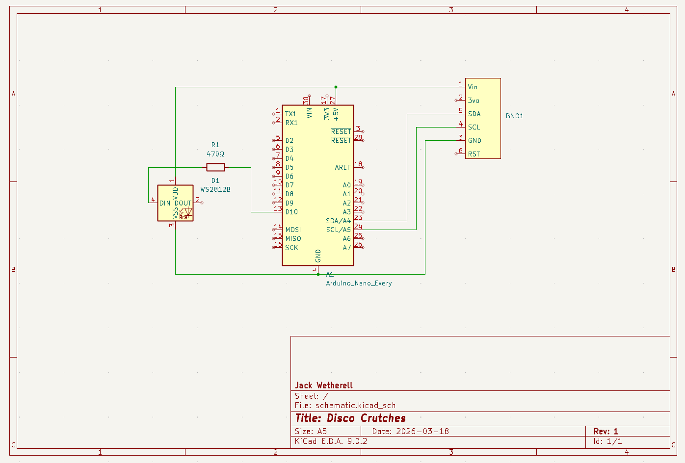

# Crutch LED System

I broke my foot and decided my crutches needed an upgrade. They are painted blue with LED strips along the structure. The Arduino-controlled LEDs twinkle like stars when idle, and with each step a blue shooting star travels up the crutch.

  

This is the code and wiring for the interactive LED system for mobility aids that reacts to walking motion using an IMU sensor.

---

## Features

- **Idle Mode**  
  Soft white twinkling LEDs.

- **Step Detection**  
  Detects motion using IMU acceleration data.

- **Dynamic Ripple Effect**  
  On each step, a ripple travels up the LED strip.

- **Color Cycling**
  White, Light Blue, Dark Blue, repeat.

- **Queued Animation**  
  Steps during an active ripple trigger the next ripple seamlessly.

---

## Hardware Requirements

- Arduino Nano (LAFVIN or compatible)
- WS2812B LED strip (100 LEDs recommended)
- BNO055 IMU sensor
- 470Ω resistor (data line protection)
- External 5V power supply (I use a power pank)
- Jumper wires (I used perfboard)

---

## Required Libraries

Install via Arduino Library Manager:

- FastLED  
- Adafruit BNO055  
- Adafruit Unified Sensor  

---

## Wiring Diagram

  

